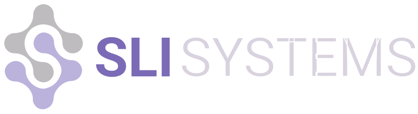

# Thiago Mata

Crafting impactful software

I offer a unique vision, combining long-term technical experience,
academic framework, analysis aptitude, and communication skills to interact with developers, investors and clients to aid decision-making 
and build
<a class="internal-link" href="#useful">useful</a>,
<a class="internal-link" href="#reliable">reliable</a>,
<a class="internal-link" href="#elegant">elegant</a> and
<a class="internal-link" href="#thrifty">thrifty</a> products.

<a href="mailto:thiago.henrique.mata@gmail.com">
    <button class="button button-primary">Let's Talk</button>
</a>

## Experience

- **20 Years** in Software Development
- **3 Years** as Tech Lead
- **2 Years** as Data Engineer
- **3** Internation Awards
- **20** Courses and Specializations
- **5 Years** as Cloud Arquitect
- **1 Year** as Co-Founder

## Top Companies

### Rokt

| &nbsp;    | &nbsp;                   |
|-----------|--------------------------|
| Position: | Senior Software Engineer |
| Duration: | 5 Years                  |
| Goal:     | Leverage Customer Data   |

---

I developed high-performance, high-availability services in a platform that processes billions of transactions and delivers personalized offers to millions of users. These services consume events and enrich the product experience and impact.

#### Cases

- [Customer Identification](./cases/rokt-identity.md)
- [Conversion Attribution](./cases/rokt-attribution.md)
- [Bot Detection](./cases/rokt-bot-detection.md)

### SLI-Systems

| &nbsp;    | &nbsp;                           |
|-----------|----------------------------------|
| Position: | Senior Data Enginner             |
| Duration: | 1.5 Years                        |
| Goal:     | Moving data streams to the cloud |

---

Enabled data-driven decision-making by developing an AI product
over a data platform with optimized data pipelines and enhanced 
data management.

#### Cases

- [To the Cloud](./cases/sli-to-the-cloud.md)

### Ideia

| &nbsp;    | &nbsp;                                   |
|-----------|------------------------------------------|
| Position: | Chief Technology Officer                 |
| Duration: | 3 Years                                  |
| Goal:     | Demographic analysis and micro targeting |

---

Development of Alexandria, a cloud-based tool that combined surveys,
machine learning and big data analytics to provide insights, reports
and recommendations to clients about their audience.

#### Cases

- [Alexandria](./cases/ideia-alexandria.md)

### Otimicar

| &nbsp;    | &nbsp;                                   |
|-----------|------------------------------------------|
| Position: | Co-Founder                               |
| Duration: | 1.5 Years                                |
| Goal:     | Make any car a smart car                 |

Developed the server that receives data from the car app and 
generates insights and recommendations for the car owner. 
It also allows the driver to share the data with car stores and mechanics.

#### Cases

- [Data Sharing](./cases/otimicar-data-sync.md)

### MEC / INEP

&nbsp;&nbsp;

| &nbsp;    | &nbsp;                                              |
|-----------|-----------------------------------------------------|
| Position: | Web Developer and Process Analyst                   |
| Duration: | 3 Years and 10 months                               |
| Goal:     | Development of the Brazilian Ministry of Education  |

While Working for the government, I analysed, specified, modelled and developed 
systems for the federal government to interact with students, schools and universities.

#### Cases

- [Education as Platform](./cases/mec-education-platform.md)

## Values

### Useful

🌠Influential and meaningful

> The largest source of waste in the startup is building a product that no one will find useful.
>
> -- <cite>Eric Ries</cite>

- 📈 Market Suitability
- 📊 Data-Driven Decision
- 🔮 Impact Forecasting
- ⚖️ Risk Management
- 🧪 Prototyping and Hypothesis Testing

### Reliable

🔒 Steady and trustworthy

>  In truth, whatever is worth doing at all, is worth doing well; and nothing can be done well without attention.
>
> -- <cite>Philip Dormer Stanhope</cite>

- ✅ Verified and Validated 
- 🛡️ Stability and Resilience 
- 📦 Progressive Delivery
- 👀 Observability
- 📉 Levels of Degradation

### Elegant

✨ Straightforward but thorough

>  Everything should be made as simple as possible, but not simpler.
>
> -- <cite>Albert Einstein</cite>

- 🪶 Simplicity 
- 🧼 Cleanliness 
- 🔍 Clarity 
- 📏 Alignment 
- 👣 Traceability

### Thrifty

🪙  Budget-conscious and efficient

>  A penny saved is a penny earned.
>
> -- <cite>Benjamin Franklin</cite>

- 🕵️‍♂️ Thoroughness
- ♻️ Resource Optimization
- ⚡ Efficiency
- 💰 Business Impact
- 🔄 Adaptability

## More About Me

Explore my professional journey, skills, and achievements in detail.

You can also reach me on
<a href="https://www.linkedin.com/in/thiagomata/">Linkedin</a>,
<a href="https://twitter.com/thiagomata">Twitter</a>,
<a href="https://github.com/thiagomata">GitHub</a>,
<a href="https://stackoverflow.com/users/456164/thiago-mata">StackOverflow</a>,
or by email at <a class="email" href="mailto:thiago.henrique.mata@gmail.com">thiago.henrique.mata@gmail.com</a>

- [One Page CV](./pdf/thiago-mata-one-page-cv.pdf)
- [Detailed CV](./pdf/thiago-mata-detailed-cv.pdf)
