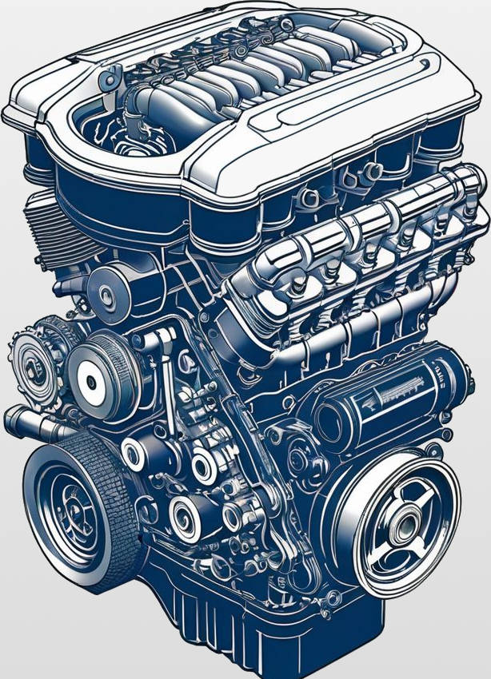

# Otimicar - Data Sync

[Thiago Mata](../README.md)

| &nbsp;    | &nbsp;                                              |
|-----------|-----------------------------------------------------|
| Company:  | Otimicar                                            |
| Position: | Co-Founder                                          |
| Summary:  | Otimicar is a solution that converts any car into a smart car. I created server-side services that allowed car owners to sync and share their data and receive recommendations and promotions. |

## Otimicar

---

Otimicar is a hardware and app solution that converts any car into a smart car. The hardware is connected to the car and shares data with the phone app via Bluetooth. The phone app sends the data to the server, which generates reports, monitoring metrics, and recommendations to customers.

I created a server-side application that receives the customer car's data, compares it with other cars of similar models, and sends reports with recommendations for services and maintenance to the customers. It also allows the customers to share their data with the mechanic workshop, car stores, and insurance companies.

## Education as a Platform

| &nbsp; | &nbsp; |
|--------|--------|
| Making it possible for customers to send their car data to different car stores, mechanic workshops, and insurance companies and then receive personalized promotions and services was an essential business requirement to make the product profitable. The challenge was that each of those partners used many different systems and didn't have any standard way of receiving or sharing data. Therefore, we had to provide many interfaces adapted to each of those services, even when they didn't properly document how they work. |  |

## Impact

We integrated with some key partners, sending data about the customers' cars. The created service ran on Google Cloud, only charging on demand. Working integration was one of the requirements of the prospected investors. Having that working boosted their confidence about the product's viability.

## Technologies

- Java
- REST
- SOAP
- GRPC
- MongoDB
- Google Web App
- IoT