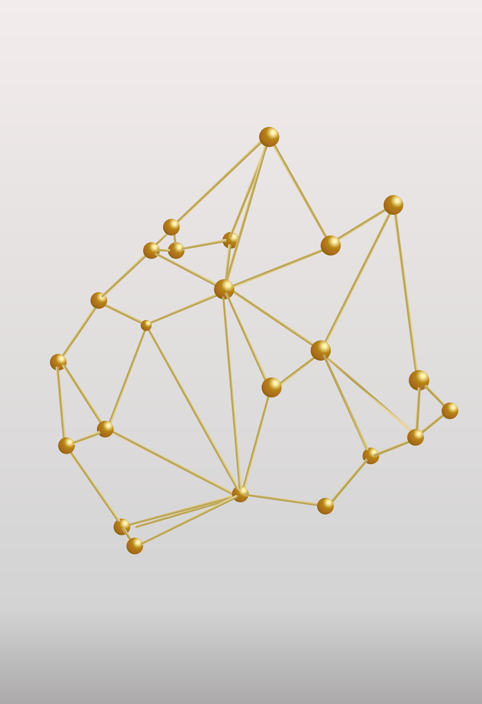

# Rokt - Identity

[Thiago Mata](../README.md)

| &nbsp;    | &nbsp;                                              |
|-----------|-----------------------------------------------------|
| Company:  | Rokt                                                |
| Position: | Senior Data Engineer                                |
| Summary:  | We developed the identity services to improve the company's personalization and relevance of the offers by better identifying the events related to each customer. |

##  Rokt

---

Rokt is a technology company specializing in e-commerce marketing, providing personalized transaction moments to enhance customer engagement and revenue. As of 2023, Rokt has over 500 million users and is valued at approximately $2.4 billion. Rokt has partnership with notable companies as Uber, Ticketmaster, Fanatics and Live Nation.

I am working at Rokt as Senior Data Engineer for the last five years. My work consist in developing services in a high-performance, high-availability, and scalable platform that processes billions of transactions per month, to deliver personalized and relevant offers to millions of users worldwide.

## Customer Identification

| &nbsp; | &nbsp; |
|--------|--------|
| One of the key factors to improve the relevance of the offers is to properly identify the customer. That requires connecting multiple touchpoints and devices to a single customer by using a multi-hop high-connected graph. We also needed to guarantee the customer data privacy and residency, and the client data isolation and encryption. We tested several approaches to improve the customer identification accuracy and speed, including using graph databases. The right approach needs to be cost-effective, scalable, secure, with low latency, ensuring zero downtime, with properly monitoring, alarms and failover. |  |

## Impact

The new identification system works on real-time, using open-source technologies, key-value database and cloud services. It is able to better identify customers, through a multi-hop customer identifiers, in a fraction of the time, and with a fraction of the resources. Using the new system, the company was able to experiment different approaches to identify customers, evaluate and use new identifers and strategies to improve the customer identification.

## Technologies

- Scala
- Spark Batch
- Spark Streaming
- Apache Kafka
- AWS EMR
- AWS Athena
- AWS Neptune
- Apache TinkerPop

## Other Cases At Rokt

- [Conversion Attribution](./rokt-attribution.md)
- [Bot Detection](./rokt-bot-detection.md)
