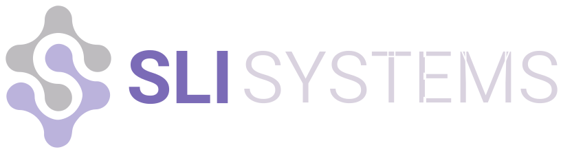

# SLI Systems - To The Cloud

[Thiago Mata](../README.md)

| &nbsp;    | &nbsp;                                              |
|-----------|-----------------------------------------------------|
| Company:  | IDEIA                                               |
| Position: | Senior Data Engineer                                |
| Summary:  | We developed new AI products and migrated the existing ones to the cloud. In this new infrastructure, I implemented many of the improvements proposed by the AI team. |

##  SLI-Systems

---

SLI-Systems is a technology company that specializes in helping e-commerce companies improve their search and navigation experience. Founded in 2001, it has offices in New Zealand, Australia, the United States, the United Kingdom, and Japan. SLI-Systems has over 1,000 customers worldwide, including Staples, Office Depot, and Harry & David.

I worked at SLI-Systems as a Senior Data Engineer for one and a half years. My work consisted of developing new AI products by translating the models from the Data Scientist to SQL and Spark Streaming and migrating the existing products to the cloud.

## To the Cloud

| &nbsp; | &nbsp; |
|--------|--------|
| The company decided to migrate the main services to the Google Cloud. That required rewriting the services from Apache Spark to Apache Beam and using Google Dataflow to run the services. During the migration, we needed to ensure that the services were still running and that the data was consistent across the two platforms. |  |

## Impact
 
One of the company's main goals was migrating the services to the Google Cloud. The new services are faster and cheaper, and the company can now scale them as needed. Having the services in the cloud improved the company's evaluation during the acquisition process.

## Technologies

- Apache Beam
- Google Dataflow
- Google Cloud
- Google BigQuery
- Google Spanner
- Google Pub/Sub
- ElasticSearch
